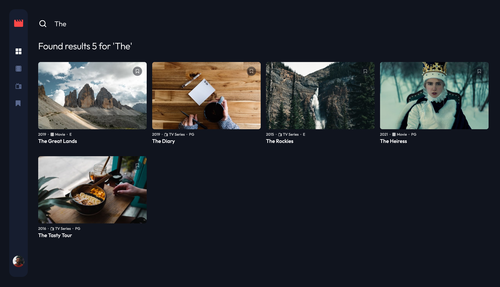
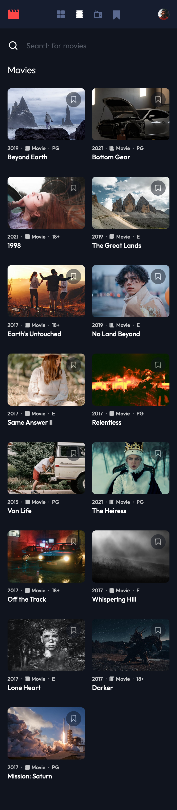
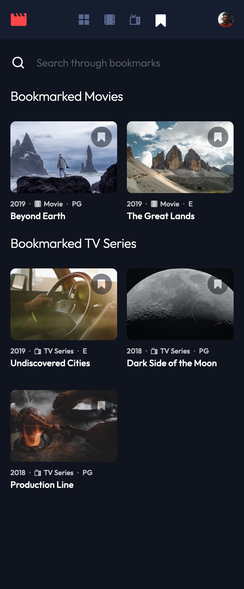

# Frontend Mentor - Entertainment web app solution

This is a solution my to the [Entertainment web app challenge on Frontend Mentor](https://www.frontendmentor.io/challenges/entertainment-web-app-J-UhgAW1X).

## Table of contents

- [Overview](#overview)
  - [The challenge](#the-challenge)
  - [Screenshot](#screenshot)
  - [Links](#links)
- [My process](#my-process)
  - [Built with](#built-with)
  - [What I learned](#what-i-learned)
  - [Continued development](#continued-development)
  - [Useful resources](#useful-resources)
- [Author](#author)
- [Acknowledgments](#acknowledgments)

## Overview

### The challenge

Users should be able to:

- View the optimal layout for the app depending on their device's screen size
- See hover states for all interactive elements on the page
- Navigate between Home, Movies, TV Series, and Bookmarked Shows pages
- Add/Remove bookmarks from all movies and TV series
- Search for relevant shows on all pages
- **Bonus**: Build this project as a full-stack application
- **Bonus**: If you're building a full-stack app, we provide authentication screen (sign-up/login) designs if you'd like to create an auth flow

### Screenshot

#### Home

#### Search

#### Movie Mobile

#### Bookmark Mobile

### Links

- Solution URL: [solution](https://github.com/roodhouse/frontend-mentor-entertainment)
- Live Site URL: [live site](https://entertainment.rugh.us)

## My process

### Built with

- HTML5, CSS
- Mobile-first workflow
- React
- Tailwind
- Python
- Flask
- MySQL

### What I learned

For this project I created a full stack app. For the backend I used Python, Flask and MySQL. This was my first time using Python and Flask and so I learned a whole bunch about the language and framework. It was also my first time to use MySQL outside of a classroom environment and I was able to reinforce concepts previously learned.

## Author

- Website - [my site](https://rugh.us)
- Frontend Mentor - [@roodhouse](https://www.frontendmentor.io/profile/roodhouse)
- LinkedIn - [John Rugh](https://www.linkedin.com/in/john-m-rugh/)
